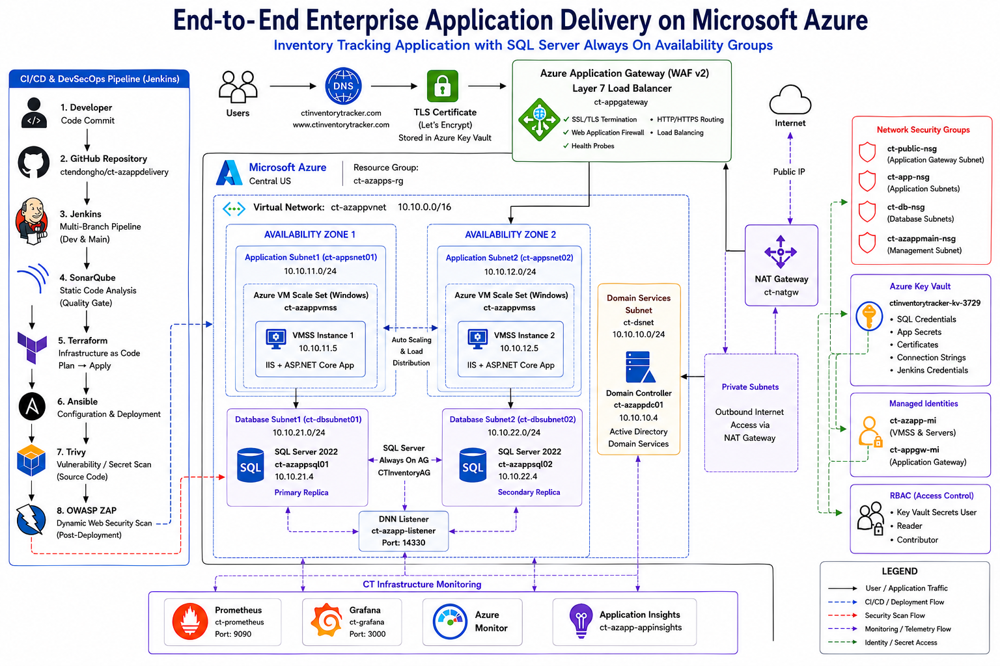
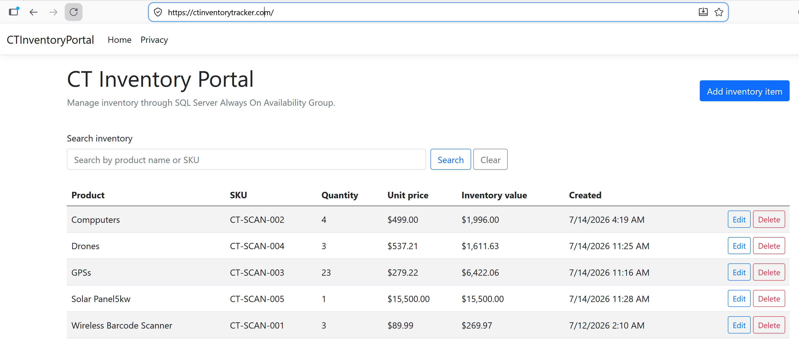
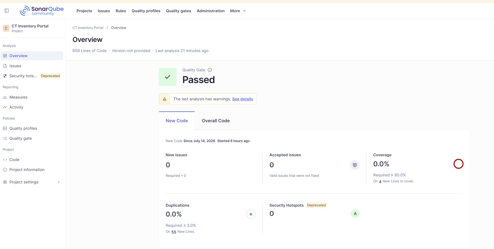
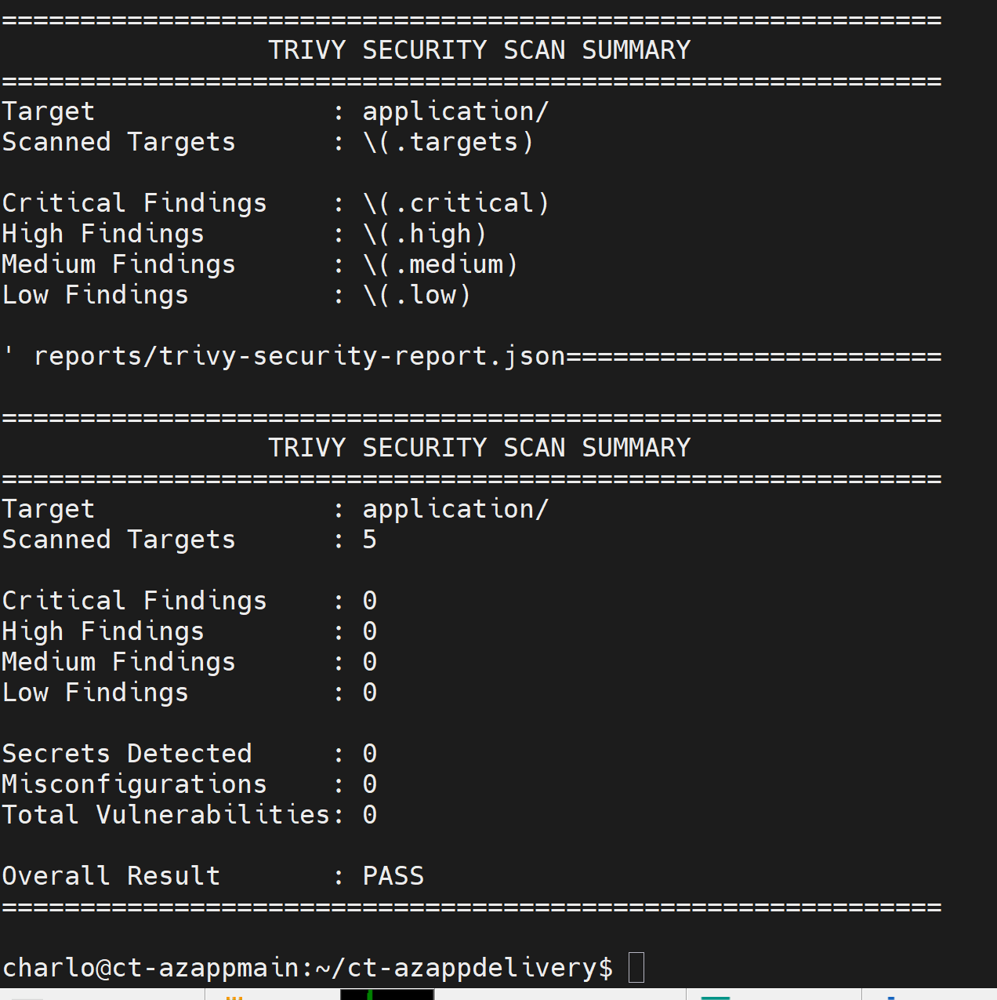
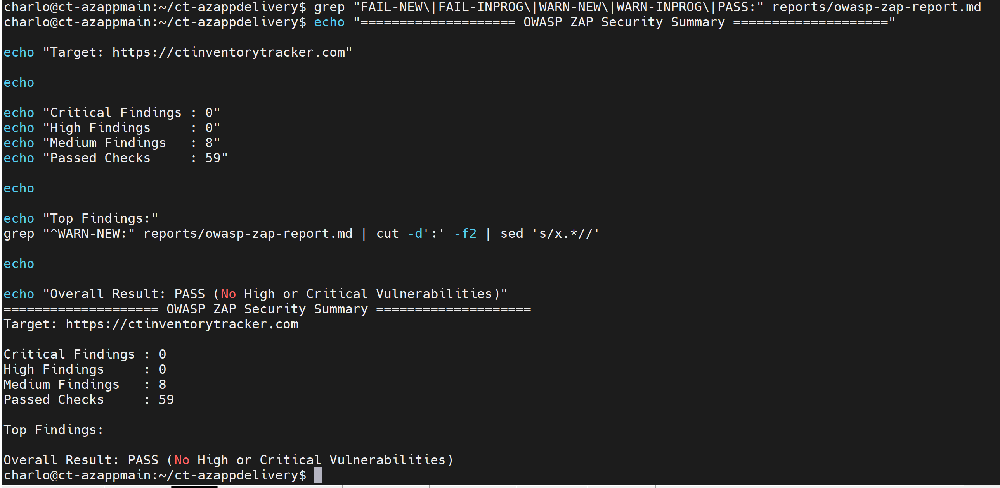
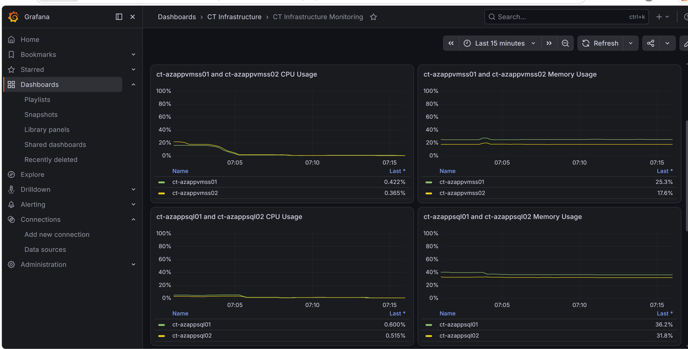
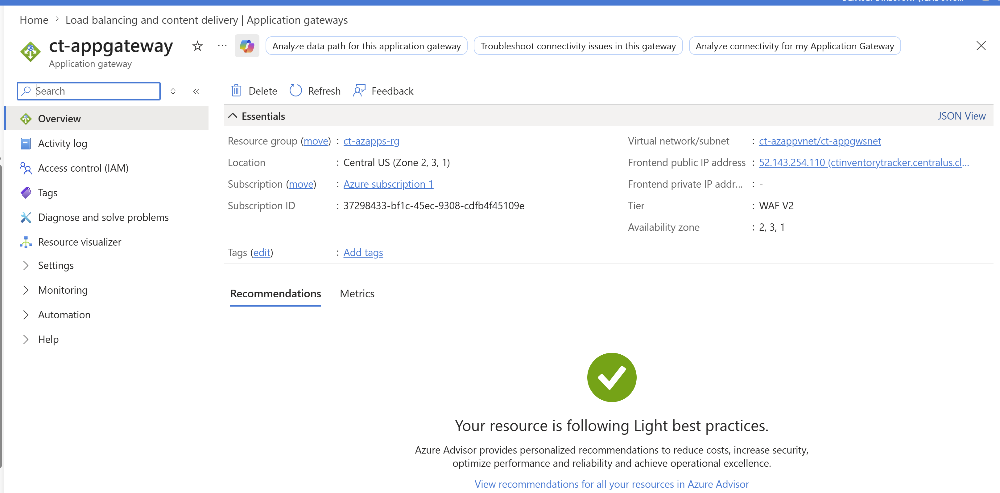
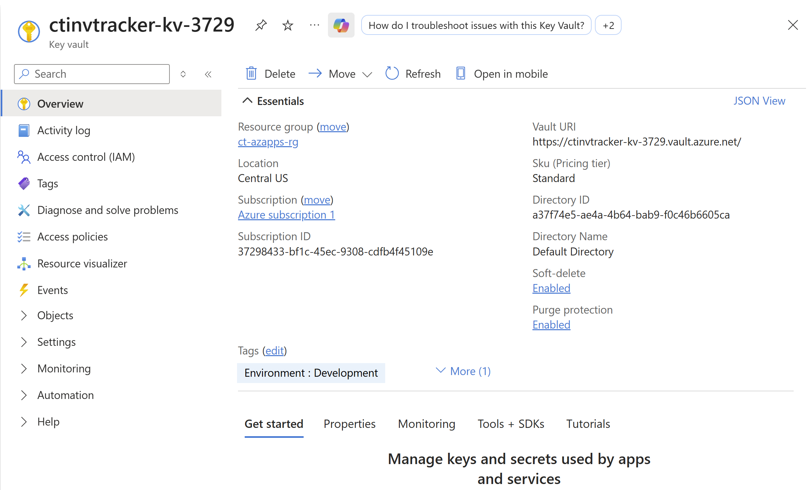

# End-to-End Enterprise Application Delivery on Microsoft Azure using SQL Server Always On Availability Groups


---

# Project Overview

This project demonstrates the design, deployment, and operation of a highly available enterprise application platform on Microsoft Azure.

The platform hosts a .NET Inventory Tracker application running on a Windows Virtual Machine Scale Set behind an Azure Application Gateway. SQL Server Always On Availability Groups provide database high availability, while Terraform and Ansible automate infrastructure provisioning and server configuration. A Jenkins Multi-Branch CI/CD pipeline continuously validates infrastructure, builds the application, performs code quality and security scans, deploys the application, and verifies the health of the platform before completing each deployment.

The project combines Infrastructure as Code, Configuration Management, Continuous Integration, Continuous Delivery, Monitoring, Security, and High Availability into a single enterprise deployment platform that closely resembles real-world production environments.

---

# Business Problem

Many organizations still rely on manual deployment processes to provision infrastructure, configure servers, and release applications. While this approach may work for smaller environments, it becomes increasingly difficult to manage as systems grow. Manual deployments often introduce configuration drift, increase the risk of human error, prolong recovery during outages, and make environments difficult to reproduce consistently.

Traditional deployment approaches also tend to separate infrastructure, application delivery, monitoring, and security into disconnected processes. As a result, deployments require significant manual effort, troubleshooting becomes time-consuming, and identifying production issues often takes longer than necessary.

This project addresses these challenges by implementing an automated enterprise application delivery platform that:

- Eliminates manual infrastructure provisioning through Infrastructure as Code.
- Standardizes server configuration using Ansible.
- Automates application delivery using Jenkins Multi-Branch Pipelines.
- Provides database high availability using SQL Server Always On Availability Groups.
- Protects sensitive configuration through Azure Key Vault.
- Continuously validates application health after deployment.
- Integrates code quality, vulnerability scanning, and web application security testing directly into the deployment pipeline.
- Monitors platform health using Prometheus and Grafana.

The result is a repeatable, secure, highly available, and production-ready deployment platform that significantly reduces operational effort while improving deployment consistency and reliability.

---

# Project Objectives

The primary objective of this project was to build a complete enterprise application delivery platform that demonstrates modern DevOps and Cloud Engineering practices on Microsoft Azure.

The platform was designed to achieve the following objectives:

- Provision Azure infrastructure using Terraform.
- Configure Windows servers automatically with Ansible.
- Deploy a .NET Inventory Tracker application through Jenkins CI/CD.
- Implement SQL Server Always On Availability Groups for database high availability.
- Secure secrets using Azure Key Vault.
- Perform automated static code analysis with SonarQube.
- Scan the application for vulnerabilities using Trivy.
- Perform web application security testing using OWASP ZAP.
- Monitor the environment using Prometheus and Grafana.
- Validate platform health automatically after every deployment.

---

# Solution Overview

The solution consists of several integrated components working together to automate the complete application delivery lifecycle.

Infrastructure is provisioned using Terraform, ensuring every deployment is consistent and repeatable. Once the infrastructure is available, Ansible configures Windows Server, IIS, SQL Server, Active Directory, and the application environment automatically.

Developers commit changes to either the **dev** or **main** branch. Jenkins detects each commit through a Multi-Branch Pipeline and executes the appropriate deployment workflow.

The pipeline performs:

- Terraform validation and planning
- Ansible validation
- Application build
- SonarQube analysis
- Trivy security scan
- Application packaging
- Manual approval (Development)
- Automated deployment
- Platform health validation

Following deployment, Jenkins verifies the health of the application, SQL Server Availability Group, DNN listener, IIS, Prometheus, Grafana, and other critical platform components before reporting a successful deployment.

---

# Enterprise Architecture

The following diagram illustrates the complete Azure platform and how each service communicates with the others.

> **Architecture Diagram**

<p align="center">

</p>

The architecture is designed around security, scalability, automation, and high availability.

User traffic enters through Azure Application Gateway, which provides HTTPS termination and routes requests to the Windows Virtual Machine Scale Set hosting the Inventory Tracker application. The application communicates with SQL Server Always On Availability Groups deployed across two availability zones for database resilience.

A dedicated management virtual machine hosts Jenkins, Terraform, Ansible, SonarQube, Prometheus, Grafana, Docker, and Azure CLI, providing a centralized administration and CI/CD environment.

Azure Key Vault securely stores sensitive configuration while Managed Identity allows Azure resources to authenticate without embedding credentials within the application or deployment scripts.

Monitoring and security are integrated throughout the deployment lifecycle using Prometheus, Grafana, SonarQube, Trivy, and OWASP ZAP.

---

# Technologies Used

| Technology | Purpose in this Project |
|------------|-------------------------|
| Microsoft Azure | Cloud platform hosting the entire environment |
| Terraform | Infrastructure as Code (IaC) |
| Ansible | Windows Server and application configuration |
| Jenkins | Multi-Branch Continuous Integration / Continuous Delivery |
| Git & GitHub | Source control and version management |
| Azure Application Gateway | HTTPS entry point and Layer 7 load balancing |
| Azure Virtual Machine Scale Set | Highly available application servers |
| Windows Server 2022 | Application hosting platform |
| IIS | Web server hosting the Inventory Tracker application |
| SQL Server 2022 Enterprise | Relational database engine |
| SQL Server Always On Availability Groups | Database high availability |
| Azure Key Vault | Secret and certificate management |
| Azure Managed Identity | Passwordless authentication |
| Active Directory Domain Services | Authentication and domain management |
| SonarQube | Static code quality analysis |
| Trivy | Vulnerability and secret scanning |
| OWASP ZAP | Dynamic web application security testing |
| Prometheus | Metrics collection |
| Grafana | Monitoring dashboards |
| Docker | Container runtime used for security tooling |
| PowerShell | Windows automation |
| Azure CLI | Azure administration |

---

# Key Features

- Fully automated Infrastructure as Code deployment using Terraform.
- Automated Windows Server configuration using Ansible.
- Enterprise Jenkins Multi-Branch CI/CD pipeline.
- Development and Production deployment workflows.
- SQL Server Always On Availability Groups with DNN Listener.
- Highly available Windows Virtual Machine Scale Set.
- Azure Application Gateway with HTTPS.
- Azure Key Vault integration.
- Static code quality analysis using SonarQube.
- Vulnerability scanning using Trivy.
- Web application security testing using OWASP ZAP.
- Prometheus metrics collection.
- Grafana monitoring dashboards.
- Automated platform health validation after deployment.
- Infrastructure validation before every deployment.
- Automated IIS deployment.
- Automated application packaging.
- Secure secret management.
- End-to-end deployment automation.

# Repository Structure

The repository is organized to separate infrastructure, configuration management, application source code, automation scripts, and documentation into clearly defined directories. This makes the project easier to maintain, extend, and troubleshoot while following common enterprise DevOps practices.

```
ct-azappdelivery/
│
├── application/                # .NET Inventory Tracker application
│
├── ansible/                    # Windows server configuration and deployment
│   ├── inventory/
│   ├── playbooks/
│   ├── group_vars/
│   └── roles/
│
├── terraform/                  # Azure Infrastructure as Code
│
├── jenkins/                    # Pipeline helper scripts
│
├── docs/
│   ├── architecture/
│   └── screenshots/
│
├── scripts/                    # Supporting automation scripts
│
├── Jenkinsfile                 # Jenkins Multi-Branch Pipeline
│
├── ansible.cfg
│
└── README.md
```

---

# CI/CD Pipeline

A Jenkins Multi-Branch Pipeline automates the complete application delivery process from infrastructure validation to application deployment and platform health verification.

The pipeline automatically detects whether changes were pushed to the **Development** or **Main** branch and executes the appropriate deployment workflow.

## Development Branch Workflow

The development pipeline is designed to provide a safe environment for validating infrastructure and application changes before they are promoted to production.

The workflow performs the following steps:

1. Checkout the latest source code.
2. Validate the active Git branch.
3. Validate Terraform configuration.
4. Generate a read-only Terraform execution plan.
5. Validate the Ansible inventory and playbooks.
6. Build the .NET application.
7. Perform static code analysis using SonarQube.
8. Execute Trivy vulnerability and secret scanning.
9. Package the application.
10. Wait for manual deployment approval.
11. Deploy the application to the Virtual Machine Scale Set.
12. Configure IIS and restart required services.
13. Validate the deployed application.
14. Verify the SQL Server Availability Group.
15. Validate the DNN Listener.
16. Verify Prometheus and Grafana.
17. Generate a deployment health summary.

---

## Production Branch Workflow

Once development testing has completed successfully, the validated code is merged into the **main** branch.

The production pipeline follows a similar workflow while removing the manual approval step to enable a fully automated production deployment.

The production pipeline performs:

- Source code checkout
- Infrastructure validation
- Terraform execution plan
- Application build
- SonarQube Quality Gate validation
- Trivy security scan
- Application deployment
- IIS configuration
- SQL Server validation
- Platform health verification
- Production deployment summary

This approach ensures that production deployments remain repeatable, predictable, and fully automated.

---

# Deployment Workflow

The platform combines Infrastructure as Code, Configuration Management, Continuous Integration, and Continuous Delivery into a single deployment workflow.

```
Developer
     │
     ▼
GitHub Repository
     │
     ▼
Jenkins Multi-Branch Pipeline
     │
     ├────────────── Terraform Validation
     │
     ├────────────── Terraform Plan
     │
     ├────────────── Ansible Validation
     │
     ├────────────── Application Build
     │
     ├────────────── SonarQube Analysis
     │
     ├────────────── Trivy Security Scan
     │
     ├────────────── Package Application
     │
     ├────────────── Deploy Application
     │
     └────────────── Platform Validation
```

Every deployment follows exactly the same sequence, ensuring that infrastructure, application code, and server configuration remain synchronized.

---

# Infrastructure Provisioning

Terraform provisions every Azure resource required by the platform, including networking, compute, storage, security, and supporting services.

Resources provisioned include:

- Resource Group
- Virtual Network
- Public Subnets
- Application Subnets
- Database Subnets
- Network Security Groups
- Azure Application Gateway
- Virtual Machine Scale Set
- Domain Controller
- SQL Server Virtual Machines
- Azure Key Vault
- Managed Identity
- Azure Storage
- Monitoring resources

Using Infrastructure as Code makes every deployment repeatable and eliminates manual configuration through the Azure Portal.

---

# Configuration Management

Once infrastructure has been provisioned, Ansible automatically configures the Windows servers.

Playbooks perform tasks such as:

- Active Directory installation
- Domain configuration
- SQL Server configuration
- Always On Availability Group setup
- IIS installation
- Inventory Tracker deployment
- Security header configuration
- Application health verification

This ensures that every server is configured consistently across environments.

---

# Security Validation

Security is integrated directly into the deployment pipeline rather than being treated as a separate activity after deployment.

The platform performs multiple automated security checks including:

### SonarQube

Static code analysis verifies:

- Code Quality
- Maintainability
- Bugs
- Vulnerabilities
- Code Smells

The pipeline continues only after the Quality Gate passes successfully.

---

### Trivy

Trivy scans the application source code for:

- Known vulnerabilities
- Exposed secrets
- Dependency issues
- Configuration weaknesses

This helps identify potential security issues before deployment.

---

### OWASP ZAP

After deployment, OWASP ZAP performs an automated baseline scan against the deployed Inventory Tracker application.

The scan validates the application against common web security risks including:

- Security headers
- Cross-site scripting indicators
- Vulnerable JavaScript libraries
- Session management
- Cache configuration
- Information disclosure

The generated reports were intentionally excluded from source control to keep the repository lightweight. Instead, the project documentation includes screenshots demonstrating successful security validation.

---

# Platform Validation

One of the primary goals of the project was to automatically verify that the environment is healthy after every deployment.

Rather than assuming the deployment succeeded because no errors occurred, Jenkins performs a series of validation checks before reporting success.

The validation process confirms:

- Application deployment completed successfully.
- IIS is serving the Inventory Tracker application.
- The `/health` endpoint returns HTTP 200.
- Both Virtual Machine Scale Set instances are online.
- SQL Server services are running.
- SQL Server Always On Availability Group is healthy.
- The DNN Listener is reachable.
- Prometheus is collecting metrics.
- Grafana dashboards are available.
- SonarQube is operational.
- Docker services are available.
- Required IIS security headers are present.

Only after every validation succeeds does Jenkins report the deployment as successful.

---

# Deployment Summary

Each pipeline execution concludes with a summarized health report showing the operational status of every major platform component.

The summary provides a quick view of the deployment outcome, making it easy to identify issues without manually reviewing hundreds of lines of console output.

This final validation stage provides confidence that the platform is functioning correctly and is ready to receive production traffic.

# Platform Demonstration

The following screenshots demonstrate the completed platform after a successful deployment. Together they highlight the CI/CD workflow, application deployment, database high availability, monitoring, security validation, and core Azure services that make up the solution.

---

# Jenkins Multi-Branch Pipeline

The Jenkins Multi-Branch Pipeline automatically discovers the **dev** and **main** branches from GitHub and maintains an independent pipeline for each branch. This approach allows development changes to be validated independently before being promoted to production.

<p align="center">

</p>

---

# Jenkins Pipeline Execution

The production pipeline validates infrastructure, builds the application, performs static code analysis, executes security scans, deploys the application, and performs automated health verification before reporting a successful deployment.

The final platform summary confirms the health of every major platform component, providing confidence that the deployment completed successfully.

<p align="center">

</p>

---

# Demo

The Inventory Tracker application is deployed automatically to a Windows Virtual Machine Scale Set running IIS. Azure Application Gateway securely publishes the application over HTTPS, providing users with a single public entry point while distributing traffic across multiple application servers.

The application demonstrates a typical enterprise inventory management system where users can create, update, edit, and manage inventory records stored within SQL Server.

<p align="center">

</p>

---

# SQL Server Always On Availability Groups

SQL Server Always On Availability Groups provide high availability for the Inventory Tracker database.

The primary replica processes all read and write operations while continuously synchronizing changes to the secondary replica. If the primary server becomes unavailable, the Availability Group can fail over to the secondary replica, allowing the application to continue operating with minimal interruption.

The screenshot below shows the Availability Group operating normally with the InventoryItems table queried from the active primary replica.

<p align="center">

</p>

---

# SonarQube Static Code Analysis

Before deployment, Jenkins performs static code analysis using SonarQube to evaluate the quality, reliability, and maintainability of the application source code.

The project successfully passes the configured Quality Gate with:

- No New Bugs
- No New Vulnerabilities
- No New Code Smells
- Passing Quality Gate

This ensures that only code meeting the defined quality standards progresses through the deployment pipeline.

<p align="center">

</p>

---

# Trivy Security Scan

Trivy is integrated directly into the Jenkins pipeline to perform automated vulnerability and secret scanning before deployment.

The scan evaluates the application source code for:

- Known vulnerabilities
- Dependency vulnerabilities
- Secret exposure
- Configuration weaknesses

Integrating Trivy into the CI/CD process helps identify potential security issues early in the software delivery lifecycle.

<p align="center">

</p>

---

# OWASP ZAP Security Scan

After deployment, OWASP ZAP performs an automated baseline scan against the running Inventory Tracker application.

Unlike static analysis tools, OWASP ZAP evaluates the live application from an attacker's perspective by inspecting HTTP responses, application headers, session handling, and common web application security risks.

The completed scan reported:

- No Critical Findings
- No High Severity Vulnerabilities
- Informational security recommendations only

This additional layer of testing helps verify that the deployed application follows recommended web application security practices.

<p align="center">

</p>

---

# Grafana Monitoring Dashboard

Prometheus continuously collects infrastructure and application metrics from the platform, while Grafana visualizes those metrics through interactive dashboards.

The monitoring solution provides visibility into platform performance, helping administrators quickly identify resource utilization trends, application behavior, and infrastructure health.

Typical metrics include:

- CPU Utilization
- Memory Utilization
- Disk Usage
- Network Activity
- IIS Availability
- Application Health

<p align="center">

</p>

---

# Azure Application Gateway

Azure Application Gateway serves as the secure entry point into the platform.

Its responsibilities include:

- HTTPS termination
- Layer 7 load balancing
- Intelligent request routing
- SSL certificate management
- Secure client connections

By routing incoming requests to the Virtual Machine Scale Set, Application Gateway improves both availability and scalability while simplifying external access to the application.

<p align="center">

</p>

---

# Azure Key Vault

Azure Key Vault provides centralized and secure storage for sensitive configuration such as credentials, secrets, and certificates.

Rather than embedding sensitive values within Terraform, Ansible, or the application itself, secrets are securely managed through Key Vault and accessed using Azure Managed Identity whenever possible.

This approach improves security while simplifying credential management across the deployment platform.

<p align="center">

</p>

# Design Decisions

Every major technology in this project was selected to solve a specific problem while balancing availability, security, scalability, and operational simplicity. The following decisions reflect the architectural choices made during the design and implementation of the platform.

---

## Why Terraform?

Terraform was selected to provision Azure infrastructure because it enables Infrastructure as Code (IaC), allowing the entire environment to be recreated consistently from source-controlled configuration files.

Using Terraform provides several advantages:

- Repeatable infrastructure deployments
- Version-controlled infrastructure changes
- Reduced manual configuration
- Easier disaster recovery
- Consistent environments across deployments

---

## Why Ansible?

Terraform provisions infrastructure, but it does not configure operating systems or applications.

Ansible was chosen to automate Windows Server configuration, Active Directory setup, SQL Server configuration, IIS installation, application deployment, and post-deployment validation.

Separating infrastructure provisioning from configuration management follows common enterprise DevOps practices while making each layer easier to maintain.

---

## Why Jenkins Multi-Branch Pipeline?

A Multi-Branch Pipeline allows Jenkins to automatically discover Git branches and execute different deployment workflows depending on the target branch.

For this project:

- The **dev** branch provides a controlled environment for validating infrastructure and application changes before deployment.
- The **main** branch represents the production deployment pipeline.

This approach supports safer software delivery while maintaining a clear promotion path from development to production.

---

## Why Azure Application Gateway?

Azure Application Gateway was selected because it provides Layer 7 (HTTP/HTTPS) load balancing with additional application-aware capabilities.

Key benefits include:

- HTTPS termination
- SSL certificate management
- Intelligent request routing
- Health probes
- Secure external application access

Compared to a traditional Layer 4 load balancer, Application Gateway provides better visibility into HTTP traffic and offers more advanced routing capabilities.

---

## Why Virtual Machine Scale Sets?

Virtual Machine Scale Sets provide a scalable and highly available application layer by allowing multiple identical application servers to operate behind a single endpoint.

This improves:

- Fault tolerance
- High availability
- Scalability
- Simplified application deployment

If one application server becomes unavailable, requests can continue to be served by the remaining healthy instances.

---

## Why SQL Server Always On Availability Groups?

The Inventory Tracker application depends heavily on the availability of its database.

SQL Server Always On Availability Groups were implemented to provide database high availability across multiple availability zones.

Benefits include:

- Automatic or manual failover
- Database redundancy
- Minimal downtime
- Continuous synchronization
- Improved business continuity

The project uses a Distributed Network Name (DNN) Listener, which simplifies client connectivity while supporting modern Windows Server Failover Cluster deployments in Azure.

---

## Why Azure Key Vault?

Sensitive information should never be stored directly within source code or deployment scripts.

Azure Key Vault provides centralized secret management for credentials, certificates, and sensitive configuration while supporting secure access through Azure Managed Identity.

This reduces operational risk and improves the overall security posture of the platform.

---

## Why SonarQube, Trivy, and OWASP ZAP Together?

Each tool validates a different aspect of application security.

| Tool | Purpose |
|-------|----------|
| SonarQube | Static code quality and security analysis |
| Trivy | Vulnerability, dependency, and secret scanning |
| OWASP ZAP | Dynamic web application security testing |

Using all three tools provides broader coverage than relying on a single security scanner.

This layered approach helps identify issues throughout the software delivery lifecycle, from source code to the running application.

---

# Challenges Encountered

Building an enterprise application delivery platform required overcoming several technical challenges across infrastructure, networking, automation, and database high availability.

### Jenkins Multi-Branch Pipeline

Designing a pipeline that supported separate development and production workflows required careful branch validation, conditional execution, and deployment approvals.

This was resolved by implementing branch-specific pipeline logic with manual approvals for development deployments and fully automated production deployments.

---

### SQL Server Always On Availability Groups

Configuring SQL Server Always On Availability Groups across multiple Azure virtual machines required careful coordination between Windows Failover Clustering, Active Directory, SQL Server configuration, and networking.

Extensive validation and testing ensured successful synchronization and reliable database availability.

---

### Windows Automation with Ansible

Managing Windows infrastructure through Ansible presented additional complexity compared to Linux environments.

Reliable WinRM communication, inventory management, and PowerShell-based automation were implemented to provide consistent server configuration and application deployment.

---

### Infrastructure Validation

Ensuring Terraform validation and planning could execute within Jenkins without exposing sensitive credentials required separating production configuration from repository documentation.

A reusable example configuration was created while sensitive values remained excluded from source control.

---

### Security Integration

Integrating SonarQube, Trivy, and OWASP ZAP into a single CI/CD workflow required coordinating multiple validation stages while ensuring deployments continued only after successful security verification.

This resulted in a deployment pipeline that validates code quality, infrastructure security, and web application security before reporting success.

---

# Lessons Learned

Developing this platform provided valuable practical experience across multiple areas of cloud engineering and DevOps.

Some of the most significant lessons learned include:

- Infrastructure as Code dramatically improves deployment consistency and repeatability.
- Configuration management is equally important as infrastructure provisioning.
- CI/CD pipelines should include validation, security scanning, and health verification—not just application deployment.
- Monitoring should be designed into a platform from the beginning rather than added later.
- High availability involves much more than deploying multiple servers; networking, clustering, storage, and application design all play important roles.
- Security is most effective when integrated throughout the software delivery lifecycle instead of being treated as a separate activity.

Perhaps the most important lesson was understanding how multiple technologies work together to deliver a single business solution rather than viewing each technology independently.

---

# Future Improvements

Although the platform already demonstrates enterprise application delivery, several enhancements could be implemented in future iterations.

Potential improvements include:

- Azure Monitor integration for centralized logging.
- Azure Front Door for global traffic distribution.
- Azure Web Application Firewall (WAF) policies.
- Azure Backup and Azure Site Recovery.
- Automatic SQL Server failover validation within the Jenkins pipeline.
- Blue/Green deployment strategy.
- Canary deployments.
- Kubernetes-based application hosting using Azure Kubernetes Service (AKS).
- GitHub Actions deployment workflow.
- Automated performance testing during CI/CD.
- Infrastructure compliance scanning with Microsoft Defender for Cloud.

---

# Conclusion

This project demonstrates the design and implementation of a modern enterprise application delivery platform on Microsoft Azure.

By combining Infrastructure as Code, Configuration Management, Continuous Integration, Continuous Delivery, High Availability, Monitoring, and Security into a single automated workflow, the platform reflects many of the technologies and practices used in real-world enterprise environments.

Beyond the technologies themselves, the project reinforced the importance of automation, repeatability, security, operational visibility, and thoughtful architectural design. It also provided valuable hands-on experience integrating multiple tools into a cohesive solution capable of supporting reliable and scalable application delivery.

---

# Author

**Charles Tendongho**

Cloud Engineer | SQL Server DBA | DevOps Engineer

GitHub: https://github.com/ctendongho

LinkedIn: *(Add your LinkedIn profile here)*

---

⭐ If you found this project helpful or interesting, feel free to fork the repository, open an issue, or leave a star.
